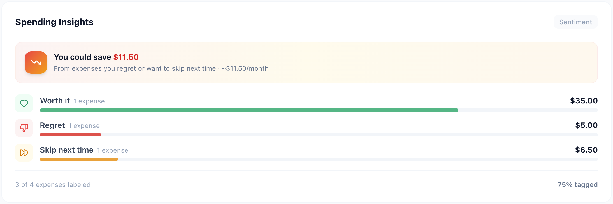
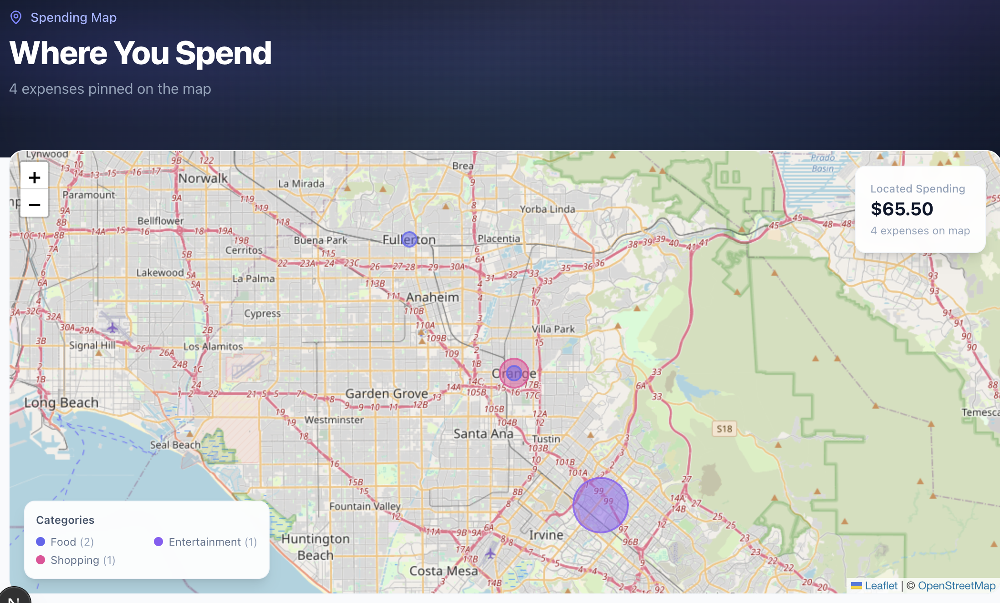
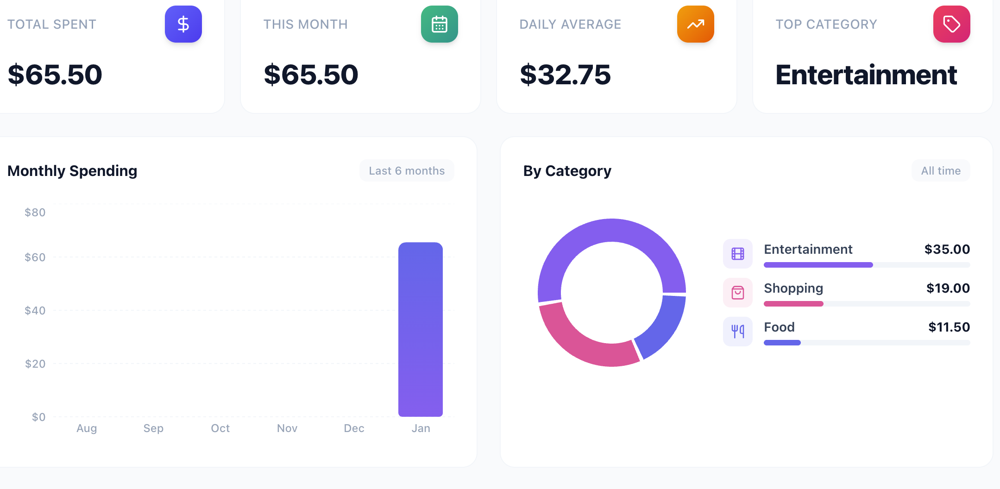
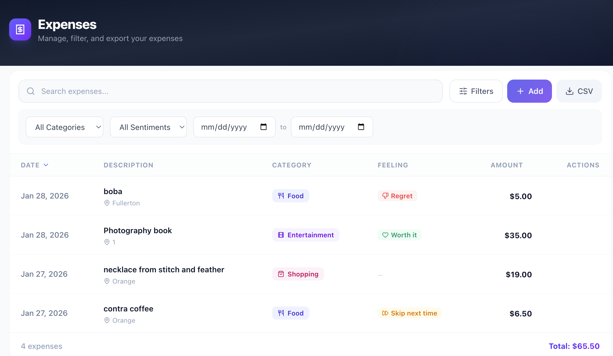

# ✨ ExpenseTracker AI

**The expense tracker that actually makes you think about your spending.**

Most expense trackers answer *what* you spent. This one asks *how you feel about it* — and shows you exactly how much your regrets are costing you.

---

## 🚀 What Makes This Different

### 🧠 Sentiment Labeling — Know Your Spending Personality

> **No other expense tracker does this.**

Tag every expense with how you actually feel about it:

| Tag | Meaning | Example |
|-----|---------|---------|
| 🛡️ **Essential** | Can't live without it | Rent, groceries, insurance |
| 💚 **Worth it** | Would buy again | Concert tickets, a great meal |
| 🔴 **Regret** | Wish you hadn't | Impulse buys, late-night shopping |
| ⏭️ **Skip next time** | Could live without | Subscriptions you forgot about |

The dashboard crunches these into a **💰 savings opportunity score** — a real dollar amount showing how much you'd save if you listened to your own gut. No finance guru needed.

<!-- 📸 Screenshot: Sentiment insights card on dashboard -->
<p align="center">
  
</p>

---

### 🗺️ Spending Map — See Where Your Money Goes (Literally)

Pin expenses to real-world locations. The interactive map visualizes your spending with:
- 🔵 **Circle markers sized by amount** — big spend = big circle
- 🎨 **Color-coded by category** — spot patterns at a glance
- 📍 **Click any marker** for full expense details in a popup
- 🏠 **Home shortcut** — one tap to tag bills, mortgage, utilities

Free OpenStreetMap geocoding. No API key. No billing surprises.

<!-- 📸 Screenshot: Map page with expense markers -->
<p align="center">
  
</p>

---

### 📊 Dashboard That Tells a Story

Not just numbers in boxes. A living overview of your financial life:

- 📈 **Spending trend** — 6-month bar chart with the current month highlighted
- 🍩 **Category breakdown** — donut chart with icon legend
- 🧠 **Sentiment insights** — how much of your spending you actually feel good about
- ⚡ **Recent activity** — last 5 expenses with category icons and location pins
- 👋 **Time-of-day greeting** — because why not

<!-- 📸 Screenshot: Full dashboard view -->
<p align="center">
  
</p>

---

### 🎨 UI That Doesn't Feel Like a Spreadsheet

Glassmorphism navbar · gradient hero sections · animated floating orbs · staggered fade-in animations · pill selectors with icons · hover-reveal actions · toast notifications · dark/light contrast design

<!-- 📸 Screenshot: Expense list with filters and sentiment labels -->
<p align="center">
  
</p>

---

## ⚡ Features

| | Feature | Details |
|---|---------|---------|
| ✏️ | **CRUD** | Add, edit, delete expenses with full validation |
| 🏷️ | **Categories** | Food, Transportation, Entertainment, Shopping, Bills, Other |
| 🧠 | **Sentiment** | Tag how you feel — get savings insights |
| 📍 | **Location** | Search any address, save a home location |
| 🗺️ | **Map** | Full-page interactive map with proportional markers |
| 🔍 | **Filters** | By date, amount, category, sentiment, date range |
| 📥 | **CSV Export** | Download filtered data with all fields |
| 💾 | **Offline** | localStorage — no backend, no account needed |
| 📱 | **Responsive** | Works on mobile with collapsible nav |

---

## Tech Stack

| Layer | Technology |
|-------|-----------|
| Framework | Next.js 16 (App Router, Turbopack) |
| Language | TypeScript (strict) |
| Styling | Tailwind CSS v4 |
| Charts | Recharts |
| Maps | Leaflet + React-Leaflet + OpenStreetMap |
| Geocoding | Nominatim (free, no API key) |
| Icons | Lucide React |
| Storage | localStorage (zero config) |

---

## Getting Started

```bash
# Install dependencies
npm install

# Start dev server
npm run dev

# Production build
npm run build && npm start
```

Open [http://localhost:3000](http://localhost:3000) and start tracking.

---

## Project Structure

```
src/
├── app/
│   ├── page.tsx              # Dashboard with charts + insights
│   ├── expenses/page.tsx     # Full expense list with filters
│   ├── map/page.tsx          # Geographic spending visualization
│   ├── client-layout.tsx     # Provider wrapper (Context + Toast)
│   ├── layout.tsx            # Root layout with fonts + metadata
│   └── globals.css           # Animations, glassmorphism, gradients
├── components/
│   ├── ExpenseForm.tsx       # Add/edit form with pill selectors
│   ├── ExpenseList.tsx       # Sortable table with inline actions
│   ├── ExpenseMap.tsx        # Leaflet map with circle markers
│   ├── LocationPicker.tsx    # Nominatim search + home shortcut
│   ├── SentimentInsights.tsx # Savings opportunity + breakdown
│   ├── SpendingChart.tsx     # Monthly bar chart
│   ├── CategoryChart.tsx     # Category donut chart
│   ├── SummaryCards.tsx      # Key metrics (total, monthly, daily avg)
│   ├── Modal.tsx             # Glass panel with backdrop blur
│   ├── Navbar.tsx            # Glassmorphism nav with active states
│   └── Toast.tsx             # Notification system
├── context/
│   └── ExpenseContext.tsx    # Global state + CRUD + computed stats
├── lib/
│   ├── storage.ts            # localStorage read/write
│   ├── formatters.ts         # Currency, date, month formatters
│   └── export.ts             # CSV generation + download
└── types/
    └── index.ts              # Expense, Category, Sentiment types
```

---

## Deploy

Works out of the box on [Vercel](https://vercel.com/new):

```bash
npm i -g vercel && vercel
```

No environment variables, no database, no API keys required.

---

Built with [Claude Code](https://claude.ai/claude-code)
